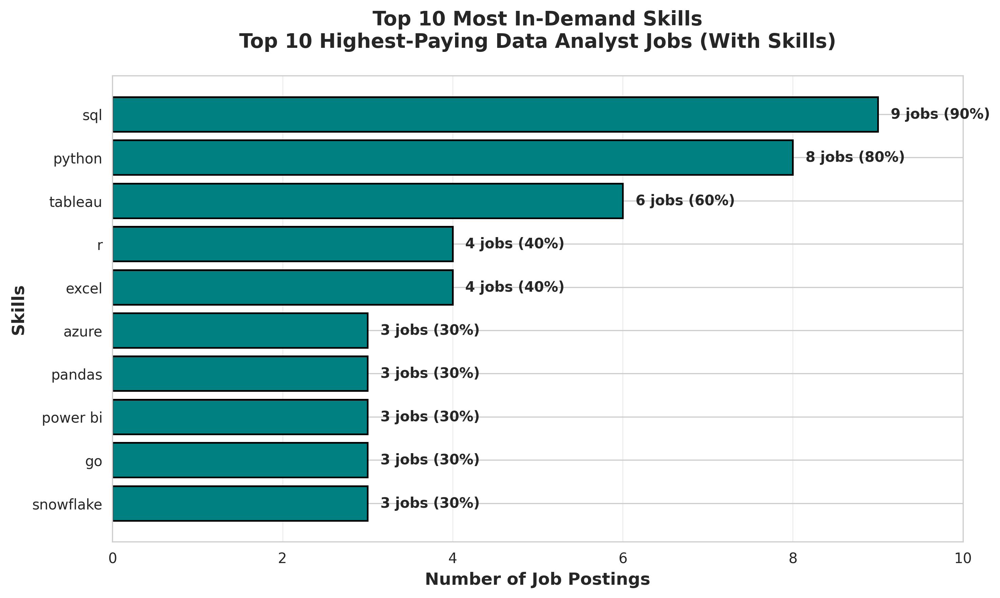

# Introduction

I worked with 787,000+ job postings to answer a simple question: To land a remote job as a data-analyst, what are the top paying jobs and what skills are in the most demand?

This project uses SQL to identify:
- 💰 Top-paying remote data analyst roles
- 🔥 Most in-demand skills
- 📈 Skills that offer both high demand AND high salary

📁 **All SQL queries:** Check them out here: [project_sql folder](/project_sql/)

# Background
After 20 years with various roles in real estate, I'm transitioning to data analytics. I built this project to understand exactly what skills employers require and what salaries to expect for certain skills.

I needed to answer a practical question: With limited time to learn new skills, what skills should I focus on?

I used SQL to analyze real job market data and identify:
- Which skills employers actually want
- What they're willing to pay for those skills
- Where increased demand intersects with increased salaries

**Data source:** The dataset comes from Luke Barousse's SQL course and includes job titles, salaries, locations, and required skills from 2023.[SQL Course](https://lukebarousse.com/sql).

### Specific questions I wanted to answer through my SQL queries were:

1. What are the top-paying data analyst jobs?
2. What skills are required for these top-paying jobs?
3. What skills are most in demand for data analysts?
4. Which skills are associated with higher salaries?
5. What are the most optimal skills to learn for employability and salary?

# Tools I Used
- **SQL:** Core of the analysis; used for all data querying and manipulation
- **PostgreSQL:** The chosen database management system, ideal for handling the job posting data.
- **Visual Studio Code:** My go-to for database management and executing SQL queries.
- **Git & GitHub:** Essential for version control, project hosting and sharing my SQL scripts and analysis.

# The Analysis
Each query for this project aimed at investigating specific aspects of the data analyst job market. Here’s how I approached each question:

### 1. Top Paying Data Analyst Jobs
To identify the highest-paying roles, I filtered data analyst positions by average yearly salary and location, focusing on remote jobs. This query highlights the high paying opportunities in the field.
**Query approach:**
- Filter for "Data Analyst" roles only
- Remote work only (job_location = 'Anywhere')
- Exclude jobs without salary data
- Sort by salary (highest first)

```sql
SELECT
	job_id,
	job_title,
	job_location,
	job_schedule_type,
	salary_year_avg,
	job_posted_date,
	name AS company_name
FROM
	job_postings_fact jpf
LEFT JOIN company_dim cd ON jpf.company_id = cd.company_id
WHERE
	job_title = 'Data Analyst'
	AND salary_year_avg IS NOT NULL
	AND job_location = 'Anywhere'
ORDER BY
	salary_year_avg DESC 
LIMIT 10;
```
**What I found:**
Here's the breakdown of the top data analyst jobs in 2023:

- **Wide Salary range:** Top 10 paying data analyst roles span from $184K - $650K (top role was a Director of Analytics)
- **Companies:** Diverse employers, showing a broad interest across different industries.  Mix of tech (Meta), finance (SmartAsset), and telecom (AT&T)
- **Job Titles vary widely:** From "Data Analyst" to "Director of Analytics" - different seniority levels have different pay scales, reflecting varied roles and specializations within data analytics.

**Key insight:** There's significant salary potential in data analytics, even in "analyst" roles.


### 2. Skills for Top Paying Jobs
Next, I wanted to know: What skills do these $200K+ jobs actually require?  I joined the job postings with the skills data, providing insights into what employers value for high-compensation roles.

**Challenge I solved:** My first query returned only 8 jobs instead of 10 because 2 jobs had no skills listed in the database. I added a filter to ensure I got 10 jobs that all have skill requirements.


```sql
WITH top_paying_jobs AS (
SELECT
    jpf.job_id,
    jpf.job_title,
    jpf.salary_year_avg,
    cd.name AS company_name
FROM 
    job_postings_fact jpf
LEFT JOIN company_dim cd ON cd.company_id = jpf.company_id
WHERE
    job_title_short = 'Data Analyst' AND
    job_location = 'Anywhere' AND
    salary_year_avg IS NOT NULL AND
    job_id IN (SELECT job_id FROM skills_job_dim)
ORDER BY
    salary_year_avg DESC
    LIMIT 10
)
SELECT 
    tpj.*,
    sd.skills
FROM top_paying_jobs tpj
INNER JOIN skills_job_dim sjd ON tpj.job_id = sjd.job_id
INNER JOIN skills_dim sd ON sd.skill_id = sjd.skill_id
ORDER BY
    salary_year_avg DESC
  LIMIT 10;
```

Here's the breakdown of the most demanded skills for the top 10 highest paying data analyst jobs in 2023:
**Results:**

| Skill    | # of Top 10 Jobs | % of Jobs |
|----------|------------------|-----------|
| SQL      | 9                | 90%       |
| Python   | 8                | 80%       |
| Tableau  | 6                | 60%       |
| R        | 4                | 40%       |
| Excel    | 4                | 40%       |



**Skills required for the top 10 highest-paying remote data analyst jobs*; ChatGPT generated this graph from my SQL query results* 

**Key insight:** SQL and Python are nearly universal requirements for high-paying roles. Tableau is the clear winner for visualization tools.


### 3. In-Demand Skills for Data Analysts

I expanded the analysis to all data analyst positions (on-site and remote) to see what skills appear most frequently in job postings, directing focus to areas with high demand.


```sql
SELECT 
    sd.skills,
    COUNT(sjd.job_id) AS demand_count
FROM job_postings_fact jpf
INNER JOIN skills_job_dim sjd ON jpf.job_id = sjd.job_id
INNER JOIN skills_dim sd ON sd.skill_id = sjd.skill_id
WHERE
    job_title_short = 'Data Analyst'
GROUP BY
    sd.skills
ORDER BY
    demand_count DESC
LIMIT 5
```
Here's the breakdown of the most demanded skills for data analysts in 2023:

| Skills   | Demand Count |
|----------|--------------|
| SQL      | 7291         |
| Excel    | 4611         |
| Python   | 4330         |
| Tableau  | 3745         |
| Power BI | 2609         |

**What this tells me:**
- **SQL is essential** - appears in more jobs than any other skill
- **Excel is still relevant** - even in 2023, spreadsheet skills matter
- **Python is the programming language in greatest demand** - not R, not Java
- **Visualization matters** - Tableau and Power BI both rank in top 5

*Table of the demand for the top 5 skills in data analyst job postings*

### 4. Skills Associated with Higher Salaries
Exploring the average salaries associated with different skills revealed which skills are the highest paying.

```sql
SELECT 
    sd.skills,
    ROUND(AVG(jpf.salary_year_avg),0) AS avg_salary
    --COUNT(sjd.job_id) AS demand_count

FROM job_postings_fact jpf
INNER JOIN skills_job_dim sjd ON jpf.job_id = sjd.job_id
INNER JOIN skills_dim sd ON sd.skill_id = sjd.skill_id
WHERE
    job_title_short = 'Data Analyst' AND
    jpf.salary_year_avg IS NOT NULL
GROUP BY
    sd.skills
ORDER BY
    avg_salary DESC
LIMIT 25
```
Here's a breakdown of the results for top paying skills for Data Analysts:

**Top 10 highest-paying skills:**

| Skills        | Average Salary |
|---------------|----------------|
| PySpark       | $208,172       |
| Bitbucket     | $189,155       |
| Couchbase     | $160,515       |
| Watson        | $160,515       |
| DataRobot     | $155,486       |
| GitLab        | $154,500       |
| Swift         | $153,750       |
| Jupyter       | $152,777       |
| Pandas        | $151,821       |
| Elasticsearch | $145,000       |

- **High Demand for Big Data & ML Skills:** Top salaries are commanded by analysts skilled in big data technologies (PySpark, Couchbase), machine learning tools (DataRobot, Jupyter), and Python libraries (Pandas, NumPy), reflecting the industry's high valuation of data processing and predictive modeling capabilities.
- **Software Development & Deployment Proficiency:** Knowledge in development and deployment tools (GitLab, Kubernetes, Airflow) indicates a lucrative crossover between data analysis and engineering, with a premium on skills that facilitate automation and efficient data pipeline management.
- **Cloud Computing Expertise:** Familiarity with cloud and data engineering tools (Elasticsearch, Databricks, GCP) underscores the growing importance of cloud-based analytics environments, suggesting that cloud proficiency significantly boosts earning potential in data analytics.

*Table of the average salary for the top 10 paying skills for data analysts*

### 5. Optimal Skills: High Demand + High Salary

This was my most important analysis: Which skills offer both good job prospects AND good pay?

I filtered for skills that appear in at least 10 remote job postings (to ensure meaningful sample size) and ranked by salary.

Combining insights from demand and salary data, this query aimed to pinpoint skills that are both in high demand and have high salaries, offering a strategic focus for skill development.

```sql
SELECT 
    skills_dim.skill_id,
    skills_dim.skills,
    COUNT(skills_job_dim.job_id) AS demand_count,
    ROUND(AVG(job_postings_fact.salary_year_avg), 0) AS avg_salary
FROM job_postings_fact
INNER JOIN skills_job_dim ON job_postings_fact.job_id = skills_job_dim.job_id
INNER JOIN skills_dim ON skills_job_dim.skill_id = skills_dim.skill_id
WHERE
    job_title_short = 'Data Analyst'
    AND salary_year_avg IS NOT NULL
    AND job_work_from_home = True 
GROUP BY
    skills_dim.skill_id
HAVING
    COUNT(skills_job_dim.job_id) > 10
ORDER BY
    demand_count DESC,
    avg_salary DESC
LIMIT 10;

```

| Skills     | Demand Count | Average Salary |
|------------|--------------|----------------|
| SQL        | 398          | $97,237        |
| Excel      | 256          | $87,288        |
| Python     | 236          | $101,397       |
| Tableau    | 230          | $99,288        |
| R          | 148          | $100,499       |
| Power BI   | 110          | $97,431        |
| SAS        | 63           | $98,902        |
| PowerPoint | 58           | $88,701        |
| Looker     | 49           | $103,795       |

*Table of the most optimal skills for data analyst sorted by demand count*

Here's a breakdown of the most optimal skills for Data Analysts in 2023: 
- **High-Demand Programming Languages:** Python and R stand out for their high demand, with demand counts of 236 and 148 respectively. Despite their high demand, their average salaries are around $101,397 for Python and $100,499 for R, indicating that proficiency in these languages is highly valued but also widely available.
- **Cloud Tools and Technologies:** Skills in specialized technologies such as Snowflake, Azure, AWS, and BigQuery show significant demand with relatively high average salaries, pointing towards the growing importance of cloud platforms and big data technologies in data analysis.
- **Business Intelligence and Visualization Tools:** Tableau and Looker, with demand counts of 230 and 49 respectively, and average salaries around $99,288 and $103,795, highlight the critical role of data visualization and business intelligence in deriving actionable insights from data.
- **Database Technologies:** The demand for skills in traditional and NoSQL databases (Oracle, SQL Server, NoSQL) with average salaries ranging from $97,786 to $104,534, reflects the enduring need for data storage, retrieval, and management expertise.

# What I Learned
Throughout this project, I've turbocharged my SQL toolkit with some serious firepower:

**Technical Skills:**
- **CTEs (WITH clauses)** - Breaking complex queries into readable steps
- **Multiple JOINs** - Combining 3+ tables to answer business questions
- **Aggregate functions** - Using COUNT(), AVG(), and GROUP BY to find patterns in large datasets
- **Subqueries** - Filtering data based on calculated conditions

**Analytical Skills:**
- **Translating questions into queries** - Turning "what should I learn?" into specific SQL logic
- **Data validation** - Catching errors (like my initial query only returning 8 jobs instead of 10)
- **Result interpretation** - Understanding what the numbers actually mean for decision-making

**Project Skills:**
- **Git workflow** - Committing, pushing, managing branches
- **Documentation** - Writing clear README files and query comments
- **Data visualization** - Creating charts that communicate findings clearly

# Conclusions and Next Steps
### Insights
From the analysis, several general insights emerged:

1. **SQL is non-negotiable**
   - Appears in 90% of top-paying jobs
   - Most demanded skill overall (7,291 mentions)
   - Foundation for everything else

2. **Python is the second essential skill**
   - 80% of top-paying jobs require it
   - Pandas, Jupyter, PySpark all point to Python ecosystem
   - Used for data manipulation and analysis

3. **Tableau wins for visualization**
   - 60% of top jobs require it
   - More mentions than Power BI in high-paying roles
   - Critical for communicating insights

4. **Cloud skills increase earning potential**
   - Azure, AWS, Snowflake all command $108K+ average
   - Not required for all jobs, but valued when present
   - Good "next step" after mastering fundamentals

5. **Specialized skills pay premiums**
   - But they're risky to learn first (low demand)
   - Better strategy: SQL/Python/Tableau first, then specialize

### Closing Thoughts

This project enhanced my SQL skills and provided valuable insights into the data analyst job market. The findings from the analysis serve as a guide to prioritizing skill development and job search efforts. Aspiring data analysts can better position themselves in a competitive job market by focusing on high-demand, high-salary skills. This exploration highlights the importance of continuous learning and adaptation to emerging trends in the field of data analytics.

This project gave me exactly what I needed: a clear, data-driven roadmap. I now know to focus on SQL, Python, and Tableau - skills that appear in 60-90% of the listed jobs.


